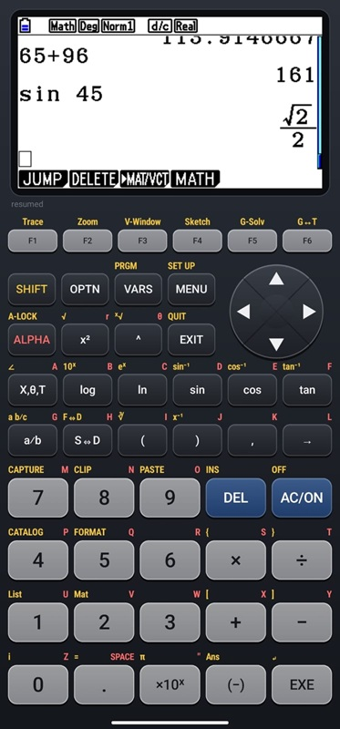

# casio-cg50

<p align="center">
  
</p>

A from-scratch **hardware emulator and reverse-engineering toolkit for the Casio
fx-CG50** (Prizm-family graphing calculator, Renesas **SH7305 / SH-4A** core), with an
**Android app** that runs it on a phone.

The emulator boots the **real fx-CG50 OS (3.60) from reset** — PLL/clock bring-up, interrupt
setup, the battery ADC, the NOR-flash (`fls0`) filesystem mount — to the MAIN MENU, and from
there runs the calculator as a calculator: every built-in app, real keyboard input, a
blinking cursor, and **third-party add-ins (`.g3a`)**.

> ⚠️ **No Casio firmware is included in this repository.** The OS is Casio's
> copyrighted property. To run the emulator you must supply a flash dump of *your
> own* calculator. See [Getting a flash dump](#getting-a-flash-dump).

## What's here

| Path | What |
|------|------|
| `emu_go/` | **The emulator (Go)** — the primary implementation. SH-4A core, the SH7305 memory map + MMU, and models of the peripherals the OS needs (below). Devices run only at their scheduled events and an idle CPU fast-forwards, so waiting is nearly free; a mid-range phone executes ~28 M instr/s of real work (the real calculator ~100 M). Also the desktop web UI and the cgo bridge for Android. |
| `emu/` | **The Python reference emulator** — the *oracle*. Slower, but the authoritative model the Go port is validated against; every CPU-visible behaviour exists in both. |
| `emu/conformance.json` | Cross-language, curated SH-4 instruction conformance suite (synthetic — not derived from any OS). Both cores replay the same frozen cases. |
| `android/` | **The Android app** (Kotlin + JNI over the Go core): the screen, a keypad drawn in the real fx-CG50 layout, save-state resume. See [`android/README.md`](android/README.md). |
| `docs/ANDROID.md` | The host API (C ABI) the Go core exports, and how the app is wired. |
| `re/` | Reverse-engineering scripts: SH-4 disassembler (`sh4dis.py` — `--image PATH` or `SH4DIS_IMAGE`; `disasm_static.py`), syscall resolvers (`syscall360.py` for OS 3.60), the keymap generator (`dump_keymap.py` → `KEYMAP.md`) and label audit (`audit_keymap.py`), and many single-purpose probes. |
| `tools/` | On-calculator helpers: `flash_dump/` (a gint/fxlink flash **dumper**), `fxsdk-docker/` (fxSDK/gint toolchain in Docker), and probe add-ins (`keyprobe/`, `timerprobe/`, `tickprobe/`) used to measure the real hardware. |
| `RECON_NOTES.md` | The full reverse-engineering log. The **RESUME HERE** block at the top is the current state and next steps. |

### What the emulator models

- **CPU:** SH-4A integer/system ISA with delay slots, register banks, interrupts and `sleep`;
  validated against real silicon for the tricky arithmetic (202/202 on-device cases).
- **MMU:** UTLB, `ldtlb`, P0/U0/P3 translation and precise TLB-miss / protection exceptions —
  which is what lets add-ins run (the OS demand-pages their code in from flash).
- **Display:** the R61524 LCD controller with its own GRAM. The screen you see is the panel,
  fed by the OS's DMA frame pushes *and* its direct pixel writes (the blinking text cursor
  is drawn straight into GRAM).
- **Keyboard:** the KEYSC key-scan unit (matrix words + key-detect/scan IRQs); the OS's own
  keyboard ISR does scanning, debouncing and auto-repeat, exactly as on the calculator.
- **Time:** RTC (calendar + 2 Hz periodic IRQ that drives the cursor blink), the 32.768 kHz
  counter and the key-scan rate, all derived from the host's real instructions/second.
- **Other:** NOR flash with a program/erase command state machine (settings persist), the
  hardware BCD ALU the number formatter needs, the battery ADC (its "done" interrupt wakes the
  idle OS — measured on the real calculator with `tools/tickprobe`), DMAC, INTC, CPG and friends.

## Status

- ✅ Boots OS 3.60 from reset; provisioned once, resumes instantly at the **MAIN MENU**.
- ✅ **All 18 built-in apps** launch and run (Run-Matrix computes and displays results, Graph
  plots, Python lists scripts, …); MENU switches between them.
- ✅ **Add-ins run** (verified with a user-built `.g3a`: launch, input, output, back to MENU).
- ✅ Real keyboard path with OS auto-repeat; blinking cursor; frames presented only when the OS
  pushes them (no half-drawn redraws).
- ✅ **Android app** on a real phone: calculator-style keypad (F1–F6, D-pad, SHIFT/ALPHA
  legends), haptics, multi-touch, save-state on pause.
- ✅ Go core validated against the Python oracle: **68-case** instruction/MMU conformance suite,
  a 2000-checkpoint golden boot trace, and transcript parity for the KEYSC and LCD models.
- ✅ All keys behave like the real calculator (checked by hand on the phone, and every label
  audited against the codes the OS produces).
- ⏳ Next: speed — held-key menu scrolling on a phone is still ~⅔ of the real calculator (ask
  Android for CPU clocks via performance hints; run the OS's bitmap blitter natively), then skin
  polish (S/A annunciator state on the keys).

## Getting a flash dump

This repo intentionally ships **no** Casio code. Dump your own fx-CG50:

- Easiest: a gint/fxlink-based dumper — see `tools/flash_dump/README.md` and `dump.c`.
- Place the resulting full flash image at **`os/flash_dump/flash_full.bin`** (16 MB).
  The `os/` directory is git-ignored precisely so firmware never gets committed.

Tests that need the flash image or a save-state self-skip when they are absent. The
instruction **conformance** test needs neither and runs standalone.

## Build & run (desktop)

```sh
# from the repo root, with your own flash_full.bin in os/flash_dump/

# provision ONCE: boot fresh, drive first-boot setup to the MAIN MENU, snapshot a save-state
go -C emu_go run . 450000000 30000 provision   # writes os/flash_dump/cg50_state.bin

# interactive: the calculator in your browser (screen + keyboard), resumes from the save-state
go -C emu_go run . 0 30000 web                 # prints the http://127.0.0.1:<port> URL
```

Web UI keys: digits/operators as typed, Enter = EXE, Backspace = DEL, Esc = EXIT,
Home = MENU, arrows, F1–F6, Tab = SHIFT, `` ` `` = ALPHA (a–z type ALPHA letters),
F9/F10 = save/reload state.

The save-state (CPU + RAM + flash delta + peripheral registers, gzip ~100 KB) is git-ignored
under `os/`, since it is derived from executing the OS. Delete it to force a fresh first-boot.
Other run modes (`seq`, `key`, `prof`, `rtbench`, `wmap`, `flashwr`, …) are RE/diagnostic
harnesses; see `emu_go/main.go`.

## Android

See [`android/README.md`](android/README.md): cross-compile the Go core with
`android/build_go_lib.ps1`, build the app, then `adb push` your `flash_full.bin` and
`cg50_state.bin` to the app's files directory.

## Tests

```sh
go -C emu_go test .                  # conformance (68) + golden boot + device/e2e tests
python emu/conformance_gen.py        # regenerate the frozen conformance cases (oracle)
python emu/gen_golden.py             # regenerate the golden boot trace (oracle)
python emu/test_cpu.py               # replay the conformance cases on the Python core
python re/audit_keymap.py            # key labels vs the codes the OS produces
```

Any change to CPU/MMIO behaviour goes into **both** `emu/` and `emu_go/`, followed by
regenerating the goldens and running the Go tests.

## Legal

This is an independent, clean-room-style reverse-engineering / emulation project for
**interoperability and education**, using a dump of hardware the author owns. It
contains **no Casio firmware, ROM images, or other Casio intellectual property** —
only original code and original analysis notes. "Casio" and "fx-CG50" are trademarks
of CASIO COMPUTER CO., LTD.; this project is not affiliated with or endorsed by Casio.

## License

[MIT](LICENSE) — covers the original code/docs here only, not any Casio material.
